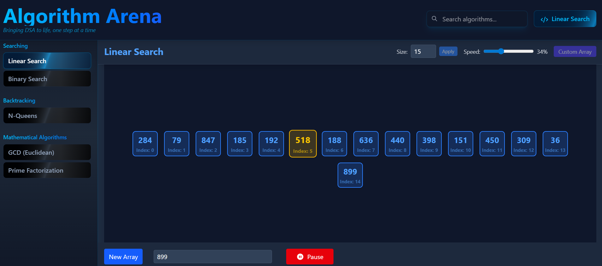
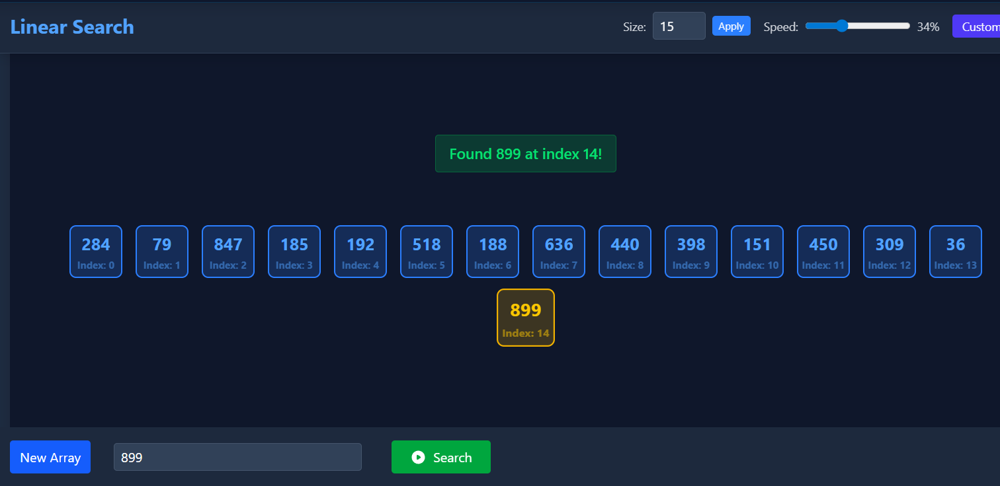
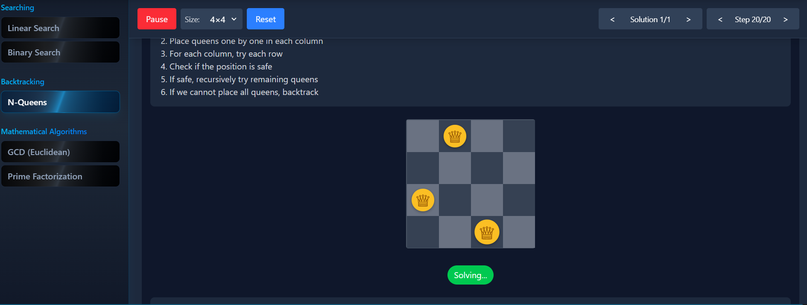
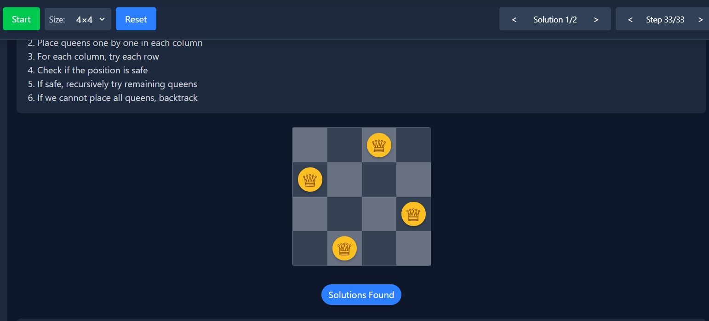
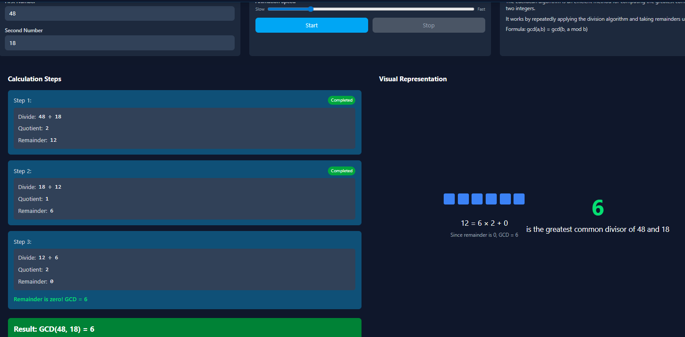

# Algorithm Visualizer

A visually interactive web application that helps users understand and visualize various algorithms categorized into **Search Algorithms**, **Backtracking (N-Queens)**, and **Mathematical Algorithms**.

## Table of Contents
- [Search Algorithms](#search-algorithms)
- [Backtracking & N-Queens](#backtracking--n-queens)
- [Mathematical Algorithms](#mathematical-algorithms)
- [Features](#features)
- [Installation](#installation)
- [Usage](#usage)
- [Contributing](#contributing)
- [License](#license)

---

## Search Algorithms

This section demonstrates popular searching algorithms such as **Linear Search** and **Binary Search**.

### Features
- Step-by-step animated search process
- Pause, resume, and speed control for better understanding
- Highlights current searching index and search result

### How it works
- Input a target value to search in the array
- Visualizes scanning or dividing-and-conquering (for binary search)
- Highlights current elements being compared in the animation

### Screenshot

---

## Backtracking & N-Queens

This section focuses on **Backtracking Algorithms**, specifically the **N-Queens Problem**.

### Features
- Interactive N-Queens solver with adjustable board sizes
- Visualizes recursive backtracking process step-by-step
- Allows pausing/resuming and navigating through multiple solutions

### How it works
- Attempts to place queens on an N×N board with no conflicts
- Animates the recursive placements and backtracking events
- Controls for speed and animation play/pause

### Screenshot

---

## Mathematical Algorithms

This section covers foundational mathematical algorithms such as:

- **Greatest Common Divisor (GCD) using Euclidean Algorithm**
- **Prime Factorization**

### Features
- Stepwise, visual breakdown of each algorithm
- Interactive controls for animation speed and pausing

### How it works
- Enter input numbers
- Algorithm runs with step-by-step visuals and highlights
- Facilitates better understanding of mathematical computations

### Screenshot

---

## Features

- Responsive design for desktop and mobile devices
- Pause, resume, and speed control for all animations
- Wide variety of algorithms in categorized sections
- Stepwise, visual highlighting during algorithm execution
- User-friendly interface to select and run algorithms

---

